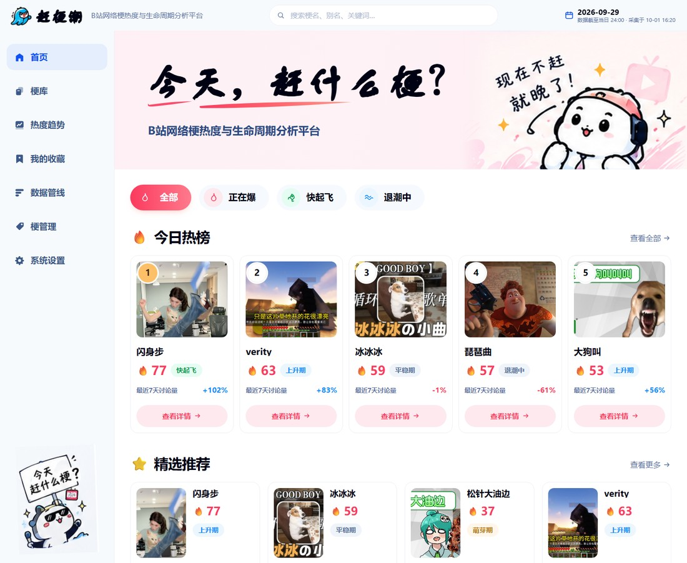
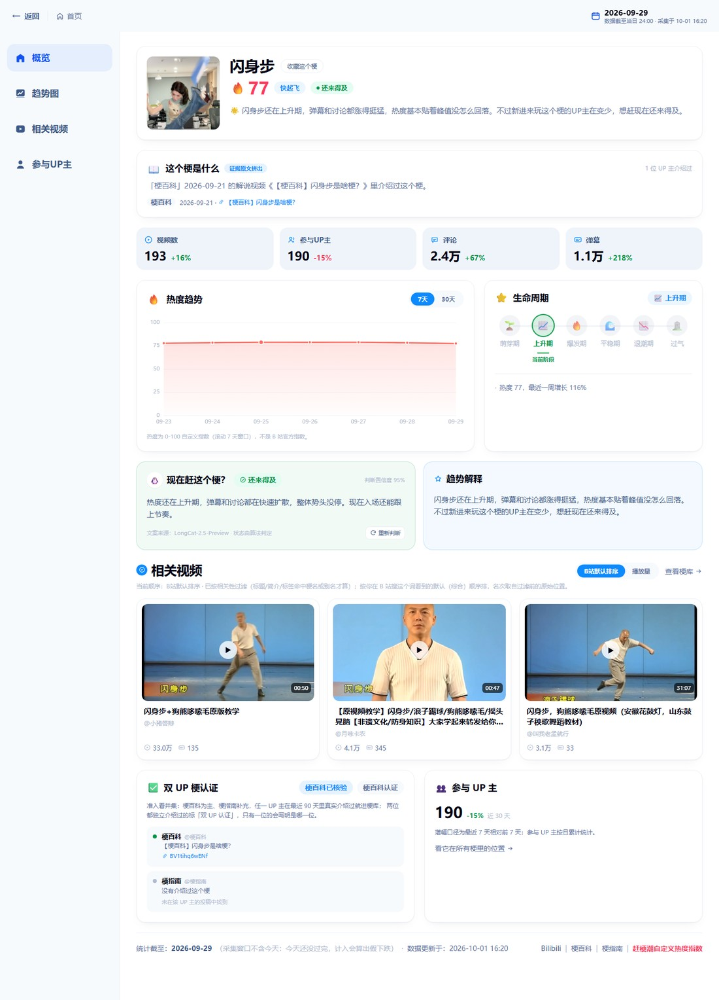
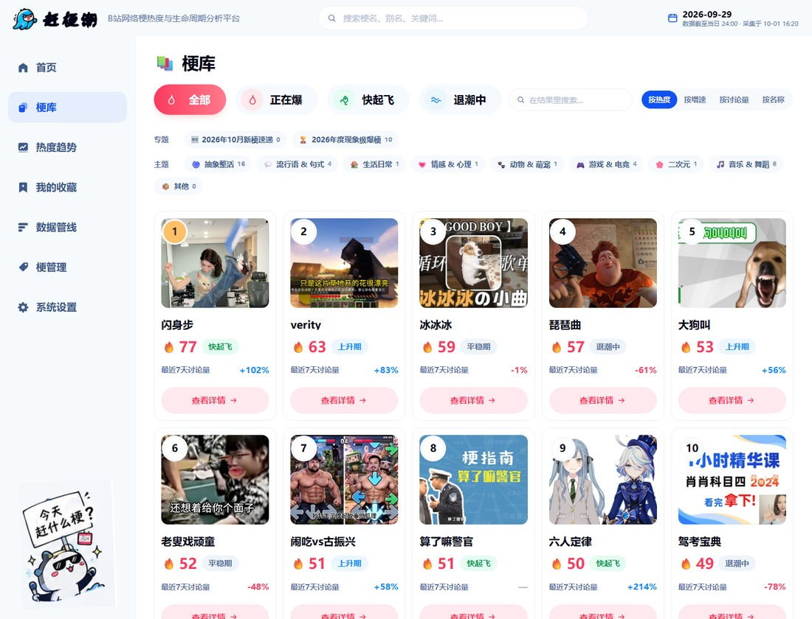
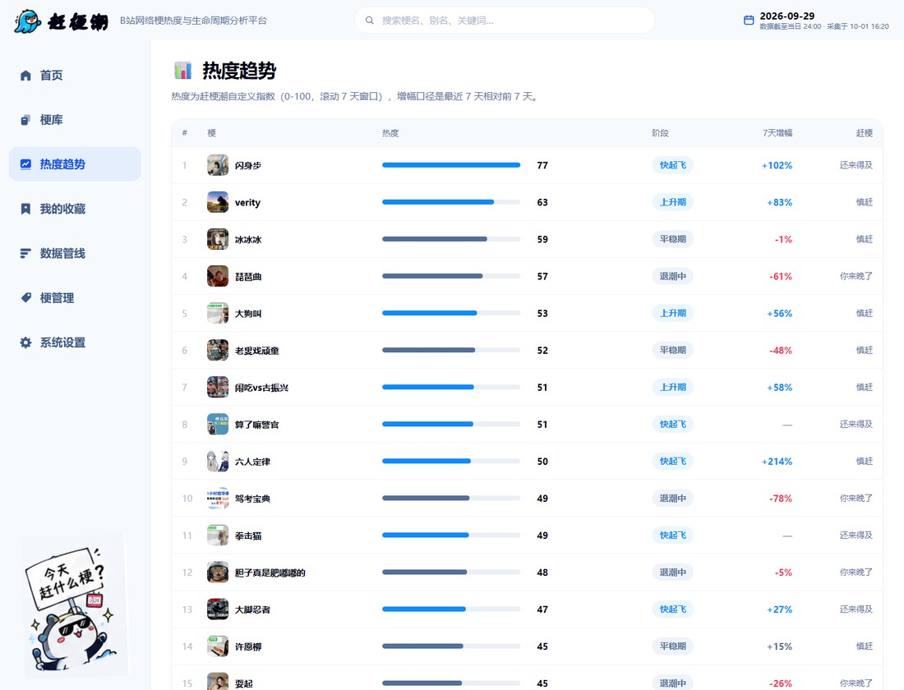
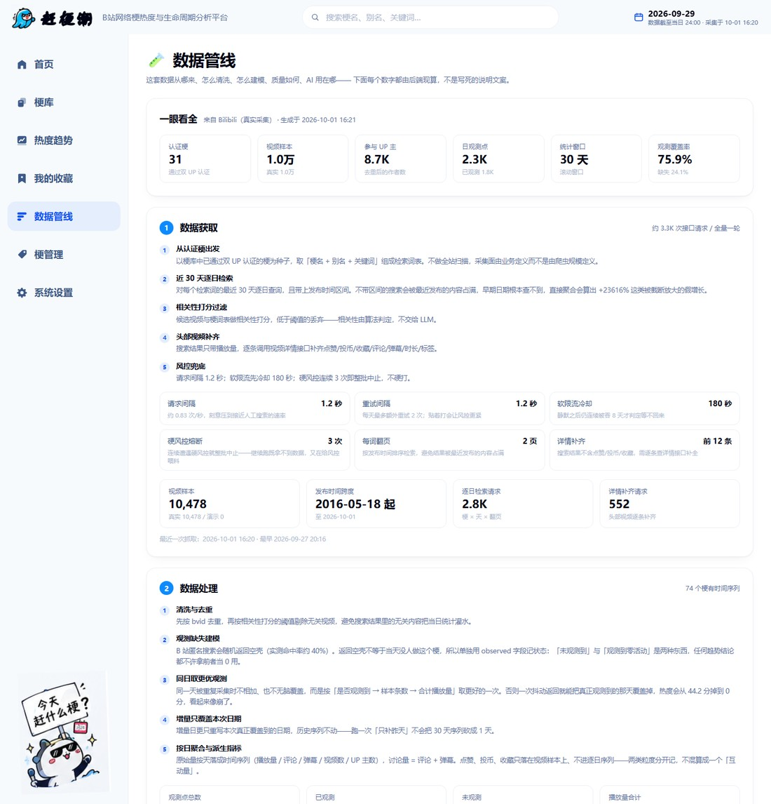
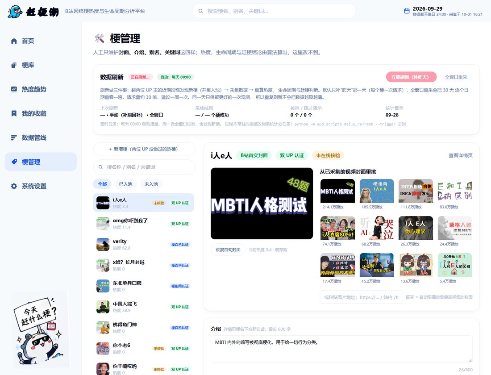

# 赶梗潮 GengChao

> **今天，赶什么梗？** —— 只看 B 站数据，判断一个梗正在起飞、爆发、退潮，还是已经过气。

一个只分析 **Bilibili 网络梗** 热度与生命周期的 Web 数据产品。

```
B站数据 → 采集 → 清洗 → 梗匹配 → 发现层准入（并集）+ 双UP认证标签 → 时间序列聚合 → 热度指数 → 生命周期 → LongCat 解释 → FastAPI → React
```

分工：**数据负责证明，算法负责判断，LongCat 负责解释，UI 负责呈现。**

---

## 〇、界面速览

下面全部是**本机实跑的真实截图**（数据来自 B 站真实采集，非设计稿、非演示数据）：
跑起来后由 `bash scripts/readme_shots.sh` 一键重截，页面改了重跑即可刷新。

### 首页 · 今日热榜

Hero、四档筛选（全部 / 正在爆 / 快起飞 / 退潮中）、今日热榜卡片——分数、阶段、近 7 天增幅都来自算法。



### 梗详情 · 热度趋势与生命周期

一个梗的完整判断链：热度指数 → 观测覆盖度 → 7/30 天趋势 → 生命周期轨道 → 赶梗结论 → 相关视频 → 认证证据。



### 梗库与热度趋势榜

| 梗库（全量已认证梗，可筛选 / 搜索 / 排序） | 热度趋势（相对位置 + 增幅 + 赶梗结论） |
| --- | --- |
|  |  |

### 数据管线与梗管理

| 数据管线（把采集与清洗的真实数字摊开） | 梗管理（人工只维护封面 / 介绍 / 别名 / 关键词） |
| --- | --- |
|  |  |

### 响应式 · 窄屏

同一套前端在窄屏下自动收成单列；小程序端（`miniprogram/`）与 Web 端共用同一批只读接口。

<p align="center">
  
</p>

---

## 一、快速开始

### 0. 一键启动（推荐，Windows）

双击仓库根目录的 **`start.bat`**：自动检查环境 → 缺依赖就装 → 选空闲端口 →
起后端与前端 → 等健康检查通过 → 打印访问地址与当前数据源。

| 文件 | 作用 |
| --- | --- |
| `start.bat` | 一键启动。启动后**按任意键即停止全部服务** |
| `start.bat --detach` | 启动后保持后台运行（服务开在两个最小化窗口里） |
| `stop.bat` | 停止 `start.bat` 记录过的全部服务 |

已实测的行为：

* 默认端口 8010 / 5173 被占用时自动往后找空闲端口（并同步告诉前端代理目标）；
* 可以同时起多份，`stop.bat` 会把记录过的端口全部停掉；
* 依赖已就绪时约 11 秒完成启动；首次运行会自动 `pip install` / `npm install`；
* 空库启动会自动灌演示数据，且此时界面与接口都会如实标成「演示数据」
  （站点标签按**库里实际数据**判定，不按 `.env` 配置判定）。

> 技术注记：两个 `.bat` 必须以 **GBK(ANSI)** 保存且不要调用 `chcp 65001`——
> UTF-8 编码的中文批处理会被中文 Windows 的 cmd 解析器切碎，实测会把
> `rem`/`echo`/`start` 标题当成命令执行报错。

### 1. 后端（Python 3.10+）

```bash
cd backend
pip install -r requirements.txt
cp .env.example .env              # 需要真实 AI 文案时填 LLM_API_KEY
python -m app.scripts.seed_data   # 建梗库骨架（幂等；库里有真实采集数据时会拒绝，除非 --force）
python -m app.scripts.run_pipeline --report   # 算热度/生命周期并打印榜单
uvicorn app.main:app --port 8010
```

想用真实 B 站数据替换演示数据（本机已验证可跑通，约 15 分钟）：

```bash
python -m app.scripts.rebuild_from_bilibili   # 逐日真实采集 + 在线核验 + 重算
# 可选：在 backend/.env 填 BILI_COOKIE 后加 --pages 20 --refresh-index，
# 才能把双 UP 认证从"未在线核验"升级为"已核验 + 真实投稿链接"
```

> 端口用 8010 是因为本机 8000 已被另一个服务占用；换端口不影响功能，下一步告诉前端即可。
> 空库启动时后端会自动灌一次演示数据，所以 `uvicorn` 单独起也能跑。

### 2. 前端（Node 18+）

```bash
cd frontend
npm install
VITE_API_TARGET=http://127.0.0.1:8010 npm run dev    # Windows PowerShell 见下
```

PowerShell：

```powershell
$env:VITE_API_TARGET="http://127.0.0.1:8010"; npm run dev
```

打开 http://localhost:5173

### 3. 常用脚本

| 命令 | 作用 |
| --- | --- |
| `python -m pytest`（backend 目录） | 279 个后端测试，全部离线（假客户端 + 内存库） |
| `python scripts/smoke_api.py` | 对运行中的后端逐个打接口（125 项） |
| `bash scripts/screenshot.sh` | Chrome 无头截图，做视觉比对 |
| `bash scripts/ui_shot.sh home "/"` | 截图 + 缩到参考图画板宽度，输出并排图与 50% 叠图（`.shots/cmp-*.png` / `blend-*.png`） |
| `bash scripts/readme_shots.sh` | 重截 README「界面速览」的实拍图（7 张，宽 1100 JPEG）→ `docs/screenshots/` |
| `python scripts/extract_ref_assets.py` | 从 `docs/design/reference-ui.png` 重切前端素材（封面、Logo、Hero 装饰带） |
| `bash scripts/restart-backend.sh` | 重启本地后端 |

后端数据侧的脚本（都在 `backend/` 下跑，写库前先备份 `backend/data/gengv1.db`）：

| 命令 | 作用 |
| --- | --- |
| `python -m app.scripts.collect_data --source bilibili --limit 3` | 单批真实采集（试水用；配 `--offset` 分批铺全库） |
| `python -m app.scripts.daily_refresh` | 每日刷新：发现新梗 + 只补 T-1 + 重算 + 写运行报告（`--full` 重采整窗口，`--skip-condense` 不给字幕生成浓缩介绍） |
| `python -m app.scripts.backfill_days <快照.db> --apply` | 用某次快照把"我们观测得更准的日子"补回现库（只换更好的天，不整体覆盖；不加 `--apply` 只出报告） |
| `python -m app.scripts.refresh_video_rank` | 只补 B 站综合排序名次（每梗 1~2 次请求，不重采日序列；`--gap` 默认 3 秒，连打会被回空页） |
| `python -m app.scripts.fetch_transcripts` | 抓解说视频字幕入库（**要 `BILI_COOKIE`**，没有就直接退出 2） |
| `python -m app.scripts.condense_intros` | 给字幕生成 AI 浓缩介绍，逐字校验通过才入库 |
| `python -m app.scripts.list_recent_certified` | 打印两位 UP 主近期投稿里的梗候选（发现层口径核对） |
| `python -m app.scripts.probe_certification` | 只读探测：某梗在两位 UP 主空间里能不能搜到（受风控限制，需 Cookie） |
| `python -m app.scripts.dedupe_memes --drop 12,34 --apply` | 删指定重名梗（默认只报告；`--drop-placeholders` 清单占位空壳） |
| `python -m app.scripts.prune_mock_memes --apply` | 删"纯演示梗"（`data_source=mock` 且库里没有任何 B 站真实证据）；不加 `--apply` 只报告要删哪些行，`--apply` 会先自动备份整库 |

---

## 二、页面

| 路由 | 内容 |
| --- | --- |
| `/` | Hero + 筛选（全部/正在爆/快起飞/退潮中）+ 今日热榜 5 卡 + 精选推荐 + 数据透明度页脚 |
| `/meme/:id` | 顶栏「← 返回 ｜ 首页」两个出口；梗头卡（热度/阶段/赶梗状态）、「这个梗是什么」介绍（四档来源，字幕原文可折叠对照）、四项指标带增幅、ECharts 热度趋势 7/30 天（含观测覆盖度）、生命周期轨道、赶梗判断、趋势解释、相关视频（**B站默认排序 / 播放量两档可切**）、认证证据（含认证强度标签） |
| `/library` | 全量已认证梗，筛选 + 搜索 + 排序 |
| `/trends` | 热度榜表格（相对位置 + 增幅 + 赶梗结论） |
| `/favorites` | 本机 localStorage 收藏，无账号体系 |
| `/manage` | 梗管理：挑封面（从该梗已采集的真实视频封面里选，或粘贴图片地址）、写介绍、维护别名与关键词；候选梗也能管 |
| `/settings` | LLM 配置（Provider/BaseURL/Key/Model/Temperature/MaxTokens）+ 测试连接 + 系统信息 |

---

## 三、核心机制

### 梗库准入与双 UP 认证（两层，真实落在数据模型上）

```
准入（发现层，并集）= encyclopedia_confirmed OR guide_confirmed   → 进梗库、被采集、被算分、上榜
认证（徽章，交集）  = encyclopedia_confirmed AND guide_confirmed  → 标签「双 UP 认证」
```

* 梗百科 `space.bilibili.com/1544008396`（主来源，日更）、梗指南 `space.bilibili.com/94510621`（补充）
* **认证窗口 90 天滚动**（`CERT_WINDOW_DAYS`）：介绍过没有看 90 天，报告/分析窗口仍是 30 天。
  解说视频通常比梗的爆发期早 1~2 周，两个窗口合成一个就会漏掉正在热的梗
* 准入为什么从交集改成并集（2026-09-27 实测）：90 天内梗百科单独介绍过 37 个梗、梗指南 22 个，
  交集只剩 8 个——交集等于让日更 UP 的选题被周更 UP 的排期否决。
  实测「闪身步」热度 81.0（当期最高）就因为只在梗百科做过而被挡在库外
* 卡片与详情页如实标出证据来自哪一位：`cert_label` = 双 UP 认证 / 梗百科认证 / 梗指南认证，
  `verification_state` = verified_both / partially_verified / unverified（只认真实抓到的投稿，
  演示数据自记自认的 `confirmed` 一律算未核验）
* 证据存在 `meme_certifications` 表；撤销一边只掉「双 UP」徽章，不会把梗踢出池子，
  两位都没做过才退回 `candidate`
* 分析管线入口 `require_certified()` 拒绝未入池梗；接口对未入池梗返回 409 并说明原因
* 演示梗库里刻意保留单 UP 入池（新梗观察A/B）与未入池（网友投稿梗）各例，用来验证两层规则各在工作

### 梗热度指数（0-100，自有算法）

```
Hotness = 0.25*ViewScore + 0.20*InteractionScore + 0.16*ContentScore
        + 0.14*CreatorScore + 0.25*GrowthScore
```

* 绝对量做**对数区间归一化**，一条爆款视频吃不掉整个榜
* 增长权重给到 0.25，只看「最近 7 天 vs 前 7 天」——去年 1 亿播放、今天没人做的梗不会霸榜
* 近两周样本过小时，增长率不外推（考古区冒出一条视频不算 +100%），整体打折
* 权重与阈值全部集中在 `backend/app/config/algorithms.py`，前端不写任何判定逻辑

### 2026-09-29 的两处算法修正（附原因）

修完之后榜首热度从 80.4 变成 76.8，阶段与赶梗结论也随之变化；下表是最新实测值。

1. **`creator` 分量原本是 `content` 的复制品。** 采集层给的 `creator_count` 是
   *当日去重作者数*，而样本里几乎每条视频来自不同作者（实测
   `creator_count / video_count` 中位数 = **1.000**，库里有 1,011 行两者相等），
   聚合层再逐日累加，于是它变成了"视频数换个名字"：
   `content` 与 `creator` 两个分量的相关系数一度是 **r = 0.9997**，
   权重 0.16 + 0.14 = 0.30 实际全给了一个因子。
   现在改用 `creator_peak`（窗口内单日去重峰值 —— 这个值 `series.py` 本来就算好了、
   却一直没被读取），r 降到 **0.952**，扣掉 `content` 能解释的部分后仍留下约 31% 的独立变异。
   *仍未解决*：真正的去重需要按 author mid 跨日求并集，而库里只存了作者名、没存 mid。
2. **`caution_min_heat` 是一条从未执行过的死规则。** 它原本是 `85.0`，而全库最高热度
   只有 80.4、`score >= 85` 的记录数为 **0**。于是高热度「慎赶」规则一次都没命中，
   所有「慎赶」都由文件末尾的兜底分支产出 —— 而兜底文案写的是
   「没有明显往上走的迹象」，最后贴在 growth 高达 +82% 的**上升期**梗上，自相矛盾。
   改成 70 之后仍然几乎不命中（热度 ≥70 的梗全库只有 1 个，且它的 `peak_gap` 是 0.018），
   所以判据换成 `peak_gap`：**"离开峰值多少"才是"窗口还剩多大"的直接度量**，
   热度高低交给上升/爆发/退潮那几条规则。现在 `peak_gap` 落在 0.10~0.35 的梗有 9 个，
   规则真在干活（`off_peak_mild` ×1、`off_peak_strong` ×7）。

顺带补了两件相关的事：

* **`plateau_band` 原本配了却没有引用** —— 平稳期只是 `classify()` 末尾的兜底 `else`，
  任何没命中前面规则的输入都会被打成平稳期。现在是显式规则。
* **新梗的 `data_source` 原本写成空串**，于是库里出现第三种"无来源"状态：
  既不是 `bilibili` 也不是 `mock`，既进不了真实榜单也拿不到「演示数据」标注。
  已改成显式的 `pending`（"已入池、待采集"），历史 11 条用
  `python -m app.scripts.fix_data_source_state --apply` 对齐。

这两类问题现在由 `backend/tests/test_threshold_reachability.py` 守着：
它会对**每条阈值**构造边界用例，确认阈值两侧给出不同结论，
并断言关键阈值落在真实数据可达的范围内。
（既有的 `test_catch_up.py` 没发现第 2 条，是因为它的用例传了 `heat=96.0` ——
一个现实中不存在的分数，恰好绕过了这个 bug。）

### 生命周期（时间序列 + 规则，不由 LLM 决定）

🌱 萌芽 → 📈 上升 → 🔥 爆发 → 🌊 平稳 → 📉 退潮 → 🪦 过气，自上而下匹配规则，
判定依据（增长率、距峰值差、连续下滑天数、活跃度）会显示在详情页。

另有一个**闸门态**「数据不足」（`insufficient`）：近 7 天真正观测到的天数不足
`min_observed_days`（默认 4）时，算法拒绝给阶段与赶梗结论，置信度记 0。
它不是第七个阶段，界面上不画进时间轴——拿接口空洞判"正在退潮"是这套产品最不该犯的错。
热度分数照给（存量水平，跨梗同一把尺子），被洞影响的是时间轴上的比较。

### 上榜门槛（准入 ≠ 上榜）

```
热榜 = 通过发现层准入（并集）∧ 认证窗口内还有真实解说证据 ∧ 有指标快照 ∧ 不是过气 ∧ 近 7 天头部播放 ≥ 1 万
```

* 准入只回答"这是不是个真梗"，首页还要回答"今天玩什么"，所以过气（考古区）的梗不进热榜，
  近 7 天连 1 万次头部播放都没有的也不进（例：「omg你吓到我了」30 天里 26 天有内容，
  但近 7 天只有 3,770 次播放，属于历史残值）
* **刻意不用"有内容天数"当门槛**：「琵琶曲」30 天只有 4 天有内容，那几天却播了 3,976 万，
  按天数卡会把脉冲型梗误杀。`active_days` 只作为诊断量存进快照与门槛理由里
* 门槛只影响首页/趋势：`GET /api/memes?scope=all` 返回完整梗库，梗库页与收藏页用的就是它；
  `/api/meta` 同时给出 `certified_count`（热榜数）、`library_count`（梗库数）与 `gated_out`（被挡掉数），
  并把门槛口径写进 `transparency.board_gate`
* 实测效果（2026-09-28）：31 个入池有数据的梗 → 12 个上热榜，被挡掉的 17 个全是过气、2 个只剩残值
* 关掉用 `LEADERBOARD_GATE=false`（只在排查数据时用）
* **热榜还必须是"最新池"**（`LEADERBOARD_REQUIRE_FRESH_CERT`，2026-09-30 加）：
  上榜资格要落到 `meme_certifications` 里**认证窗口内有 `published_at` 的真实解说证据**，
  不能只看 `encyclopedia_confirmed` 这种一次性布尔标记——它一旦为真就永远为真，
  而解说视频是会过期的。梗库定义本来就写着"任一 UP 主在近 90 天真介绍过"，
  这条闸门就是把定义变成可执行的查询。
  实测（2026-09-30，小号 Cookie 之后）：45 只梗有窗口内真实证据 → 20 只热榜里
  **0 只**出自池外；旧口径下漏进梗库口径的 2 只（走个面儿、被生活磨平了妙脆角）
  解说证据已出窗，现在被挡在热榜外（`scope=all` 仍然查得到）。

### 赶梗判断

`can_catch / caution / too_late` 三态由算法给出，附带置信度与一句算法自己的判断。
LLM 只能润色这句话，**不能改状态**：模型返回的 `status` 与算法不一致时以算法为准，
文案里出现「预计/未来 7 天/一定会爆」这类预测口吻会被直接丢弃。

### 梗管理：人工只碰展示层

`/manage`（接口 `/api/manage/memes*`）允许人工维护**四个字段**：封面、介绍、别名、关键词。
白名单写死在 `app/services/meme/manage.py` 里，请求 `hotness`、`certified` 这类字段会被 400 拒绝，
保存也不会触发重算——热度、生命周期、赶梗结论只能由算法从数据里算出来。

* 封面优先级：人工挑的 > 该梗播放量最高视频的 B 站真实封面 > 演示素材图 > 表情贴纸；
  人工封面在接口里带 `manual: true`，详情页会显示「人工封面」标记
* 可挑的封面来自已采集的真实视频（按播放量排序、去重），演示数据没真封面就是空列表
* 别名与关键词影响搜索命中与后续采集的相关性过滤，改完不会追溯已算好的指标
* ⚠️ V1 不做登录体系。写接口默认**不校验令牌**（`ADMIN_TOKEN` 留空时放行），
  只适合本机或内网使用；**放到公网前必须设置 `ADMIN_TOKEN`**（见下）
* 写接口守卫：设置 `ADMIN_TOKEN` 后，以下接口要求请求头 `X-Admin-Token: <值>`，
  缺失或错误返回 401：
  `/api/manage/*`、`/api/jobs/*`、`/api/settings/llm`、`/api/llm/*`、
  `POST /api/memes/{id}/insight`
* 只读接口（`/api/health`、`/api/meta`、`GET /api/memes*`）**始终公开**——
  小程序端只走这几个，因此开不开令牌都能正常用

### 数据刷新：手动 + 每天定点自动

刷新做三件事：翻两位 UP 主的近期投稿**发现新梗**（并集入池）→ **采集**（老梗补数据、
新梗建序列）→ **重算**热度/生命周期/赶梗判断。

| 方式 | 怎么做 | 说明 |
| --- | --- | --- |
| 手动 | 梗管理页「数据刷新」面板，或 `POST /api/jobs/refresh` | 立刻返回 202，前端每 5s 轮状态；已在跑就 409，不排队 |
| 命令行 | `python -m app.scripts.daily_refresh [--full] [--skip-discovery]` | 计划任务用这个；跑完写 `docs/data/refresh-report.md` + `backend/data/last_refresh.json` |
| 定时 | `.env` 里 `REFRESH_AT=00:00` | **默认留空 = 不自动**，不往别人机器上塞后台任务；进程不常驻请改用系统计划任务 |
| 启动补跑 | `REFRESH_ON_START`（默认开） | 00:00 那一刻笔记本多半在睡。开了定时之后，启动时若发现"统计截至"滞后超过一天就自动补一次，不用等到第二天 |

**默认只补"昨天"那一天**，不是每天重采 30 天：75 个梗 × 30 天 ≈ 两千多次搜索，
纯烧风控额度，而 T-1 只需要 75 次。老日子的头部播放量会随时间涨，所以留了
`REFRESH_FULL_WEEKDAY`（默认周一）每周做一次全窗口校准——配合"同日只保留更好的
一次观测"，重采只会把数修准，不会把数据越刷越薄。

采集范围默认 `scope=real`：跳过库里造出来的纯演示梗（B 站上不存在，搜了也只会拿到
无关结果），当前 84 个梗里只刷 75 个。手动投稿进来的候选梗不算演示数据，照常刷新。

`REFRESH_AT` 为空时启动补跑也不会动——没开定时就说明用户想手动控制。

退出码写进报告，计划任务据此就能报警：0 正常 / 1 部分失败（有梗被拒或一个没采到）/
2 数据源不可用 / 3 已有刷新在跑（文件锁 `backend/data/.refresh.lock`，超 3 小时视为残留可抢）。
`/api/meta` 带 `refresh.last` 与 `refresh.schedule`，Web 与小程序的口径页都会显示
"上次几点刷的、谁触发的、自动刷新开没开"。

### 梗介绍：详情页的「这个梗是什么」

真实梗里 31/55 条 `description` 是空的，点进详情页只剩一片空白，用户会以为系统坏了。
所以介绍按四档来源合成（`app/services/meme/intro.py`），界面用 `intro.source` 标出来：

| 来源 | 什么时候用 | 界面标注 |
| --- | --- | --- |
| `manual` | 梗管理里人工写过介绍 | 「人工撰写」 |
| `transcript` | 没人工介绍，但抓到了解说视频字幕 | 「字幕原文摘录」/「字幕原文（AI 缩短）」 |
| `evidence` | 前两样都没有，但抓到了真实证据 | 「证据原文拼出」 |
| `none` | 全都没有 | 「暂无介绍」+ 去梗管理补的入口，不留白 |

四档的共同点：**每个字都能在 `videos` / `meme_certifications` / `video_transcripts`
三张表里逐字找到**。摘录只清洗噪声——话题标签、外链/BV 号、"求三连"式刷屏
（这类占比超过 35% 直接判为不可用），剥完不足 40 字就不摘。

#### 字幕这一层是怎么来的（2026-09-29 实测）

以前只能拿"标题 + 简介"拼介绍，那不是视频里说的话。内容层只有一条来路：B 站字幕轨。
实测匿名请求 `player/wbi/v2` 返回 `code=0` 但 `subtitles` 是空数组，B 站自己的 AI 视频
总结端点直接 `-101 未登录` —— **没有 `BILI_COOKIE` 就没有字幕**，这不是解析能绕的。

1. `python -m app.scripts.fetch_transcripts`：按梗清单抓字幕（双 UP 认证解说在前，
   `--top N` 再带上头部相关视频），按 bvid 存进 `video_transcripts`；已有字幕默认跳过。
   结束时分档报覆盖率：人工 CC / AI 识别 / 确实没字幕轨 / 匿名拿不到 / 被风控。
2. 详情页规则选段：只把命中「这个梗 / 出自 / 来历 / 所谓 / 评论区」这类说法、
   且长度够的句子按原文顺序拼起来（≤220 字），折叠区给原文（≤1200 字）。
   挑不出一句就退回 `evidence`，不随便抓一句开场白当介绍。
3. `python -m app.scripts.condense_intros`：让模型把选段缩短到 ≤140 字。
   **AI 只负责决定留哪几句，不负责写句子**——校验按"整句照抄"做：半句不算、改一个词
   不算、模型自己加的句子全部记进 `invented` 丢弃；拼接顺序永远按原文顺序。
   一处对不上就整段作废，页面继续用未缩短的规则摘录。结果缓存在 `ai_insights`
   （键 = bvid + 字幕指纹），所以每日刷新会带着跑一次而不重复烧额度；
   详情接口**只读缓存**，不为一行文案让页面等模型几十秒。

AI 字幕要单独标出来（`kind_label`）：机器听写把专有名词听错是常态，
不标就等于把错字当原文引用。

### AI 不是单点故障

* 未配 Key：文案位置显示算法自己写的那句话，并标注「文案来源：算法兜底」
* 调用失败/超时：`catch_up_advice` 返回 `unavailable`，卡片给出「暂时无法生成 + 重新判断」
* 热度、生命周期、图表、B 站数据全部不依赖 AI，照常渲染
* 结果按 `(meme_id, kind, data_version)` 缓存，数据没明显变化不再打接口
* 429/5xx/超时会重试，但次数有限（默认 2 次，指数退避），绝不无限重试

---

## 四、当前数据集：真实 B 站数据

`backend/.env` 里 `DATA_SOURCE=bilibili`，热榜与梗库展示的指标都来自 B 站真实抓取；
库里仍留着 12 条演示梗与 108 条演示视频（`data_source=mock`，界面按 `meme_data_source`
标「演示数据」，不进真实榜单）。下面这些数是 2026-09-29 从 `/api/meta` 与库内实测的，
统计窗口 30 天：

| 项目 | 实测结果 |
| --- | --- |
| 梗库 / 热榜 / 候选池 | 35 个入池 · 20 个上热榜 · 1 个未入池候选 |
| 库里的梗记录 | 85 条：62 条真实来源 + 12 条演示 + 11 条还没采到（候选或手工新建） |
| 真实视频 | 5,044 条（另有 108 条演示数据，来源字段分开，不混算） |
| 逐日序列 | 2,209 行，覆盖 2026-08-28 ~ 09-28 |
| 近 7 天观测率 | 254/451 天（56%）——没观测到的日子记 `observed=0`，不当成"当天没人做这个梗" |
| B 站综合排序名次 | 63 个有真实视频的梗里 **61 个有名次**（1,150 条视频带名次），够两档排法用 |
| 有指标快照的梗 | 72 个（其余是采到但窗口内没内容，界面显式说"数据不足"而不是给 0 分） |
| 字幕 / 浓缩介绍 | 0 条 —— 表已建好，等 `BILI_COOKIE`（实测匿名请求只返回空字幕轨） |
| 榜首示例 | 闪身步 76.8（上升期）· 耍起 67.2（上升期）· 闹吃vs古振兴 54.6（慎赶） |
| 最近一轮全量回补 | 目标 76 / 成功 51 / 空窗 25，耗时 16,696 秒（约 4.6 小时，含重试） |

重建整个数据集（约 15 分钟，会覆盖现有数据）：

```bash
cd backend
python -m app.scripts.seed_data                # 先建梗库骨架（有真实数据时会被拦下）
python -m app.scripts.rebuild_from_bilibili    # 在线核验 + 逐日真实采集 + 重算指标
```

### 真实采集的统计口径（重要，别误读）

* **逐日区间查询**：对每个梗的最近 30 天，每天单独查一次 B 站搜索
  （`pubtime_begin_s/pubtime_end_s` + `order=click`），取当日播放量最高的前 20 条相关视频作为样本。
  所以「当日播放量」是**该日头部内容的合计**，不是该梗全站绝对量；跨日、跨梗用同一把尺子，形状与排序可信。
* 为什么不一次搜完再聚合：不带日期区间时搜索结果会被最近发布的内容占满，早期日期根本查不到，
  直接聚合会算出 **+23616%** 这种被截断放大的假增长（第一版就是这么翻车的）。
* 日统计的互动量 = 评论 + 弹幕（搜索接口给得到的字段）；点赞/投币/收藏只对头部视频逐条补齐，
  用于详情页视频卡展示，不回灌日统计，避免两个口径混用。
* 不含"今天"：当天还没过完，计入会让最后一天假性下跌。顶栏日期位与页脚因此显示
  **「统计截至 YYYY-MM-DD」**，不是"今天"——这是口径，不是数据没刷新。
* 增幅有基数门槛：前 7 天讨论量不足 30（`MIN_GROWTH_DISCUSSION`）时不报百分比，
  卡片显示"—"。基数 3 涨到 20 也是 +567%，但那是噪声。
* 相关视频有**两档排法**：`sort=view` 是播放量降序；`sort=rank` 是 B 站搜这个梗的
  默认（综合）顺序——那是用户自己在站内看到的排列，掺了相关性与时效，头部常是
  几百万播放的老稿（实测「琵琶曲」站内第 1 是 987 万播放那条，逐日头部样本里根本没有它）。
  名次存在 `videos.search_rank`，取**相关性筛之前的原始位置**，宁可跳号也不谎称名次；
  一条名次都没抓到时接口如实退回播放量（`sort_applied=view` + note 说明），不返回假排过序的列表；
  界面把「B站默认排序」划掉标（暂无名次），否则用户只会觉得"按钮点了没反应"。
  补历史名次用 `python -m app.scripts.refresh_video_rank --gap 3`：B 站对连打会回空页
  （`code=0` 但 `result` 为空），第一轮 62 个梗连着跑就有 29 个空手，加间隔后只剩 1 个。
  同一页还会重复给同一个 bvid，入库前必须按 bvid 去重——`videos(meme_id,bvid)` 是唯一键。
* **短别名不能单独判定相关**：中文 2~3 字的别名基本就是常用词。
  「我不是黄豆」的别名"黄豆"会撞上琵琶曲黄豆版、炒黄豆、树叶做豆腐——旧规则里
  别名命中即 0.85，`0.6×0.85=0.51` 直接过阈值，于是 418 条样本里 343 条其实只在讲黄豆
  （该梗当时还是热度榜第一）。现在短别名（< `STRONG_ALIAS_LEN`=4）只算弱证据，
  必须再有第二个词（描述/标签/另一关键词）佐证；4 字以上别名（赛博木鱼）与梗名命中不变。
* 梗名是常用口语时（「啊对对对」「这很难评」）B 站会把结果模糊匹配到无关内容，
  采集会自动退回**别名**再查一轮，取有内容天数更多的那一版。
* 一次空窗不会删掉上次采到的真实快照（只清掉非同源/演示行），
  重采结果比上次薄时会打 WARNING 并计入 `thinned`。
* **「没看见」不等于「没有」**：B 站匿名搜索会返回两种完全不同的"空"，
  必须先分清（2026-09-30 实测，见 `docs/ppt/tools/diagnose/README.md`）：

  | 情况 | 返回体 | 含义 |
  | --- | --- | --- |
  | 真的没内容 | `{"result": [], "numResults": 0}` | **可信**：当天确实没有 |
  | 被限流吞掉 | `{"v_voucher": "voucher_xxx"}` | **不可信**：这次没给我 |

  后者是风控应答（HTTP 200、无错误码），搜「动画」这种绝对有内容的词也会被吞。
  它会随持续请求累积：**冷启动命中率约 98%，连续打几百次后掉到 0~30%，
  且处罚窗口是数小时级**（实测停 180 秒后仍然 3/3 被吞）。
  旧实现把两者混成 `rows == []`（`numResults` 缺失时兜底成 0），于是「被限流」
  在库里和「当天没人做这个梗」长得一样——2036 行日统计里 1412 行是这种假零，
  「琵琶曲」被判"退潮/你来晚了"就是这么来的（用户实测打脸：它每天仍有 700~1000 条新视频）。

  现在：`search_range` 检出 `v_voucher` 就抛 `BilibiliThrottled`，不再返回 `([], 0)`；
  每天最多重试 `collect_day_retries`+1 次，仍拿不到就写 `observed=0`；
  命中限流会触发 `collect_throttle_cooldown` 秒的**会话冷却**（缓解，不是解药）；
  同日合并按 `(observed, video_count, view)` 比优劣，一次空返回不许盖掉上次真观测；
  `stale_days` 只数观测到的日子；观测不足 4/7 天时生命周期与赶梗一律判「数据不足」。
  卡片与趋势接口带 `observed_days` / `coverage`，趋势图把没观测到的日子画成断口/虚线柱。

  > ⚠️ **全库重采在匿名状态下做不完**：75 梗 × 30 天约 2250 次请求，打到几百次就进处罚。
  > README 后面「最近一轮全量回补耗时 4.6 小时、还剩 25 个空窗」的原因就在这里，
  > 不是脚本不会重试。每日增量刷新（只补 T-1，约 75 次请求）能跑，正是因为它请求量小。
  > **想稳定拿到数据、或想把历史空窗一次性补回来，必须配 `BILI_COOKIE`。**
  >
  > 两道保险（2026-09-30 加，都可在 `backend/.env` 调）：
  >
  > * `COLLECT_REQUEST_GAP`（默认 **1.2 秒** ≈ 0.8 次/秒）。以前采集器里写死 0.35 秒
  >   （2.9 次/秒），那是"人手疯狂敲搜索框"的量级，正是把会话快速打进限流的原因。
  >   全库重采约 3,300 次请求，1.2 秒只比 0.35 秒多花半小时；更保守可以设 2~5。
  >   建议配**小号** Cookie：主号不该拿来承担风控风险。
  > * `COLLECT_BLOCK_ABORT_AFTER`（默认 **3**）：连续 3 个梗撞上**硬风控**
  >   （HTTP 412 / `code=-352`，即 `BilibiliBlocked`）就中止整批采集，退出码 4，
  >   终端和 `docs/data/refresh-report.md` 都会写明中止原因。软限流只是把结果吞掉，
  >   硬风控是风控升级的信号——继续跑既拿不到数据，又在给风控喂料。设 0 = 关掉这道保险。
  >
  > 一旦看到 412 / -352（而不只是 `v_voucher`），就是该停手的时候。
* **已知未修的口径偏差**：`view` 是"该日发布的 cohort 在被查那一刻的累计播放"，
  老日子多攒了十几天，序列天生向"今天"下坡，所以 7 天 vs 前 7 天的增长率偏高估跌。
  年龄中性的替代量是 B 站返回的当日结果总数（`search_total`，实测上周 789/天 vs 这周 750/天）。
  改这个要重排热榜与全部赶梗结论，2026-09-28 决定先修可信度、暂不动公式。

刷新数据（约 20~35 分钟，可中断）：

```bash
bash scripts/refresh-data.sh          # 全量重采 + 重算，末尾回报覆盖率与前 5
LIMIT=5 bash scripts/refresh-data.sh  # 先拿 5 个梗试一下
```

### 梗库怎么长出来：发现层脚本 + 在线核验受风控限制

入库口径由 `app.scripts.list_recent_certified` 决定：翻两位 UP 主的真实投稿 →
从标题抽梗名 → **并集入池**（写法不同的同一梗会保守合并）→ 带真实 bvid / 标题 / 发布时间入库 →
逐日采集 → 重算。

```bash
cd backend
PYTHONIOENCODING=utf-8 python -m app.scripts.list_recent_certified --ingest   # 报告 30 天 / 认证 90 天
```

但本机实测：**只能拉到每位 UP 主最近约 150~400 条投稿**（`space/wbi/arc/search` 深翻页被 -352/412 挡住），
拉不到就如实记在报告的「缺口」一节里，不会拿旧证据凑数。因此：

* 只有一位的投稿被拉到，池子照样出（准入是并集），该梗标 `partially_verified`；
* 演示阶段造的假 BV 号已全部清除，未核验的证据**不给可点开的链接**（`linkable=false`）；
* 手写演示梗的 `certified` 是自记自认的，不算真实证据，所以真实模式下 `verification_state=unverified`
  的梗一律不进榜单（`LEADERBOARD_REQUIRE_VERIFIED`）；
* 想要更完整的核验：在 `backend/.env` 填 `BILI_COOKIE`（浏览器登录 B 站后复制），
  再跑 `python -m app.scripts.rebuild_from_bilibili --pages 20 --refresh-index`，
  命中的梗会自动升级为「已在线核验」并带上真实投稿链接。

---

## 五、数据来源与诚实性

* 标注只做**反向声明**：库里含演示数据时显式挂「演示数据」/「含演示数据」，
  真实采集到就不挂任何正面标签（原先那颗「B站真实数据」已删——那是我们自己的声明，
  用户没法核对，而"这是演示数据"是可执行的提醒，两者不对等）；
  每个梗仍带 `meme_data_source`，混跑时也能分清
* 演示数据按生命周期原型生成曲线（上升/爆发/平稳/退潮/过气各有形状），
  且「当日播放量 = 当日视频数 × 单条播放量」自洽，过气梗近两周真的归零
* 梗名称/别名取自真实存在的 B 站梗文化说法，但**所有数值都是生成的**
* 梗封面用「主题色 + 表情」贴纸块占位（本机无图像生成额度），
  比例/圆角/裁剪与参考图一致，换成真实封面不需要改布局
* 侧栏吉祥物与 Hero 吉祥物直接复用项目提供的 `docs/design/元素1.png`、`元素2.png`

### 真实 B 站采集（已跑通，默认关闭）

在本机验证过：WBI 签名后 `搜索接口` 与 `视频详情接口` 匿名可用，
一次 `--limit 2` 的采集真实拉回 218 条视频并算出了热度与生命周期。

```bash
python -m app.scripts.collect_data --source bilibili --limit 3
# 分批铺全库（实测 68 次请求/梗、约 3.2 分钟/梗：一批 10 个梗 ≈ 30 分钟，全库 ≈ 3.5 小时）
python -m app.scripts.collect_data --source bilibili --offset 0  --limit 10   # 第一棒
python -m app.scripts.collect_data --source bilibili --offset 10 --limit 10   # 第二棒
# 一把梭：--scope real 会自动跳过 B 站上不存在的纯演示梗
python -m app.scripts.collect_data --source bilibili --scope real
# 或
curl -X POST "http://127.0.0.1:8010/api/jobs/collect?source=bilibili&limit=3"
```

已知限制（重要）：

1. **UP 主空间接口被风控**（`code=-352`），要拉两位 UP 主的真实投稿作为认证证据，
   需要在 `backend/.env` 填 `BILI_COOKIE`。没有 Cookie 时认证仍沿用梗库既有记录，
   且**不会拼半份证据**。
2. **视频内容层也只有登录态才有**：`player/wbi/v2` 匿名返回 `code=0` 但字幕轨是空数组，
   B 站自己的 AI 视频总结端点直接 `-101 未登录`。所以梗介绍里的「字幕原文摘录」这一档
   要 `BILI_COOKIE` 才有内容，没 Cookie 时如实退回标题+简介拼的证据（见「梗介绍」一节）。
3. 单次抓取只能得到「当天发布的视频 + 此刻的累计指标」，
   越早的日期样本越稀疏，所以**首次真实采集会把增长率算得偏高**。
   要得到可信的时间序列，需要每天定时跑一次采集积累。
4. 一个梗只保留一份数据来源：采集时会先清掉该梗旧数据，避免演示与真实混算。

---

## 六、目录结构

```
backend/
  app/
    api/          # FastAPI 路由：memes / llm / settings / jobs / meta
    models/       # SQLAlchemy：Meme, MemeCertification, Video, MemeDailyStats,
                  #           HotnessSnapshot, LifecycleSnapshot, AIInsight, VideoTranscript
    schemas/      # 请求体模型
    services/
      llm/        # config / client / service（LongCat 走 OpenAI 兼容接口）
      meme/       # certification（准入并集 + 双 UP 徽章）、discovery（发现层并集）、
                  # intro（介绍四档来源 + 字幕规则选段）、summary（AI 浓缩 + 逐字校验）、
                  # query（读侧组装）、manage（人工四字段）
      pipeline.py # 采集 → 匹配 → 聚合 → 热度 → 生命周期
      settings_store.py  # 把前端填的配置写回 .env
    analytics/    # relevance / series / hotness / lifecycle / catch_up / aggregation
    collectors/   # mock_collector / bilibili_collector / base 契约
    prompts/      # trend-explanation.txt / catch-up-advice.txt / intro-summary.txt
    config/       # settings(.env) / algorithms(阈值) / logging(带密钥脱敏)
    mock/         # 演示梗库与曲线
    scripts/      # seed_data / run_pipeline / collect_data / daily_refresh / backfill_days /
                  # refresh_video_rank / fetch_transcripts / condense_intros / rebuild_from_bilibili
  tests/          # 279 例
frontend/src/
  api/  types/  hooks/  components/  pages/  utils/
miniprogram/      # 微信小程序端（Taro 4 + React + TS）：一份源码出 weapp / h5
  src/api/        # 只读接口封装（地址可按环境覆盖），不调没有鉴权的写接口
  src/pages/      # 热榜 / 梗库 / 口径 三个 tab + 详情页
  tests/          # 21 例：展示层纯函数 + 对着真实后端的接口契约
docs/             # 产品与前端提示词、UI 参考图（前端按它 1:1 复刻）
scripts/          # smoke_api.py / screenshot.sh / restart-backend.sh
```

小程序端的启动、上线前置条件（HTTPS + 合法域名 + AppID + 给写接口加鉴权）与
响应式做法见 [miniprogram/README.md](miniprogram/README.md)。

---

## 七、验收清单

### 产品

- [x] 名称「赶梗潮」，首页标题「今天，赶什么梗？」，副标题为 B 站梗定位说明
- [x] 首页梗榜 → 详情页 → 热度 → 生命周期 → 趋势 → 还来得及/慎赶/你来晚了，闭环成立
- [x] 首页不出现「AI 智能分析 / AI 预测 / AI 助手」字样
- [x] AI 文案是自然中文、不报数字、不写成报告、不自称 AI

### 数据

- [x] 只分析 Bilibili，无抖音/小红书/微博等
- [x] 梗库准入（并集）与双 UP 认证（交集徽章）两层规则，模型 + 管线 + 接口三处强制，且有测试
- [x] 热度与生命周期均由算法计算，AI 不参与任何数值判断
- [x] 演示/真实数据全站明确标注，接口与前端都带 `meme_data_source` 与 `verification_state`
- [x] 真实数据已替换演示数据：35 个入池梗、5,044 条真实视频、逐日 30 天序列
- [x] 接口空返回不当成"零活动"：`observed` 标记 + 同日取更好观测 + 观测不足拒给趋势结论
- [x] 介绍四档来源可核对（人工 > 字幕原文 > 标题简介原文 > 显式暂无介绍），每档都标来源、
      系统一个字都不改写；AI 只允许整句照抄着缩短，逐字校验不过就整段作废
- [x] 界面只做反向声明：含演示数据才标「演示数据」，不再挂「B站真实数据」这种自我认证

### AI

- [x] Provider / Base URL / Model / Temperature / Max Tokens / Timeout 均可 `.env` 配置
- [x] API Key 不进前端、不进日志、不进 Git（`.env` 已忽略，日志有脱敏过滤器）
- [x] LLM 必须经后端：前端只调用自己的 FastAPI
- [x] 无 Key、错误 Key、超时三种情况都不会让页面崩，且可「重新判断」
- [x] 结果按数据版本缓存；不做未来数值预测

### UI

- [x] 冷白画布 + 纯白卡片 + 珊瑚红主强调，毛笔体标题，年轻向而非企业 BI
- [x] 无紫色渐变 / 机器人 / 芯片 / 神经网络 / 聊天框 / 玻璃拟态 / 粒子
- [x] 动画克制（卡片 hover 上浮、当前阶段脉冲、图表 tooltip），Desktop 优先，移动端单/双列可用

### 测试

- [x] `python -m pytest` → 279 passed（认证闸门、算法七态、热度边界与 NaN、相关性阈值、阈值可达性、
      赶梗三态、观测覆盖度闸门、LLM 降级与缓存、字幕抓取与逐字校验、采集层离线全流程、接口集成）
- [x] `python scripts/smoke_api.py` → 125/125 通过（对运行中的真实服务）
- [x] `npm test`（miniprogram）→ 21 passed；两端 `tsc --noEmit` 干净，Web 构建通过
- [x] `npm run build` 通过；首页 JS 204KB（gzip 66KB），ECharts 拆到详情页
- [x] 后端停机时前端渲染错误态 + 启动提示 + 重新加载，不白屏

---

## 八、安全

* `backend/.env` 已在 `.gitignore`，仓库里只有 `.env.example`
* 日志经 `SecretRedactionFilter` 脱敏，`api_key=` / `Bearer` / `sk-` 形态会被替换
* `/api/settings/llm` GET 只返回掩码；PUT 时留空表示不修改 Key
* 前端构建产物已扫描，无任何密钥字样
